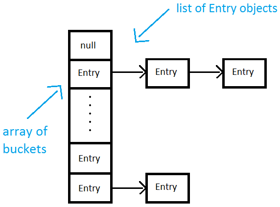
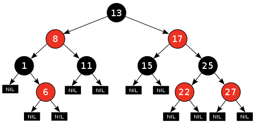

### HashMap
- Map 인터페이스를 구현한 대표적인 Map 컬렉션으로 해싱을 이용하여 처리함
- 해시 함수에 문자열 입력 값을 넣어서 특정한 값으로 추출하는 것을 의미
- 해시 함수가 변경되지 않는 이상 해싱 했을 때 특정 값에 의해서 나오는 결과 값은 항상 동일
- 해시 함수
  - 임의의 길이를 갖는 임의의 데이터를 입력받아 고정된 길이의 데이터로 매핑하는 단방향 함수를 의미
    - 입력 값이 길이가 달라도 출력 값은 언제나 고정된 길이의 비트열로 반환
    - 동일한 값이 입력되면 언제나 동일한 출력 값을 보장

- 키 값을 해싱하고, 해싱된 결과 값은 특정 Bucket을 가르키고 있음
- 해당 Bucket은 Entry로 이루어져있는 List이며 연결리스트 처럼 가르키고 있음
- 해싱된 결과 값을 이용하기 때문에, 정렬되지 않음
- 또한 입력과 삭제는 해싱을 이용하여 O(1)로 처리가 가능 함, 조회도 O(1)

### TreeMap
- 이진트리를 기반으로 한 Map 컬렉션
- TreeMap에 객체를 저장하면 자동으로 정렬됨, 키는 저장과 동시에 자동 오름차순으로 정렬
- 정렬기준: 숫자 > 알파벳 대문자 > 알파벳 소문자 > 한글
- 부모 키 값과 비교하여 키 값이 낮은 것은 왼쪽 자신 노드, 키 값이 높은 것은 오른쪽 자식 노드에
- TreeMap은 SortedMap 인터페이스를 구현하고 있어 데이터를 저장할 때 HashMap보다 삽입, 삭제에 있어서 불리함
- 정렬된 데이터를 조회해야 하는 범위 검색이 필요한 경우 TreeMap에서의 효율성이 좋음

- 내부적으로 TreeMap은 레드블랙트리로 이루어져있음
- 레드 블랙 트리는 이진 탐색 트리의 문제점을 보완한 트리로 값이 한쪽으로 편향하게 들어올 경우 한쪽 방면으로 크게 치우쳐진 트리가 되어 굉장히 비효율적이게 됨
- 레드 블랙 트리는 스스로 균형을 잡아서 데이터의 추가나 삭제 시 트리가 한쪽으로 치우쳐지지 않도록 재 수정함

### 결론
- HashMap은 해싱을 통해 저장하기 때문에 순서를 보장하지 않지만, TreeMap은 RedBlackTree구조를 이용하여 키 값을 기준으로 자동 정렬 됨
- HashMap의 삽입, 삭제, 조회는 O(1)을 띄며 TreeMap은 삽입, 조회 등의 작업은 O(logN)을 보장
- 빠른 조회가 요구될 때는 HashMap 정렬된 Map을 써야할 때 또는 범위 검색이 필요할 때는 TreeMap을 이용하자

레드블랙트리 영상
https://www.youtube.com/watch?v=2MdsebfJOyM