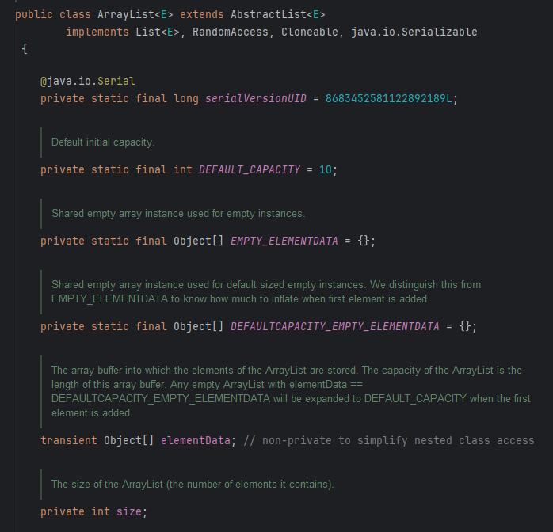
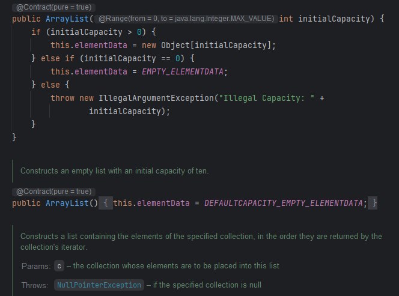
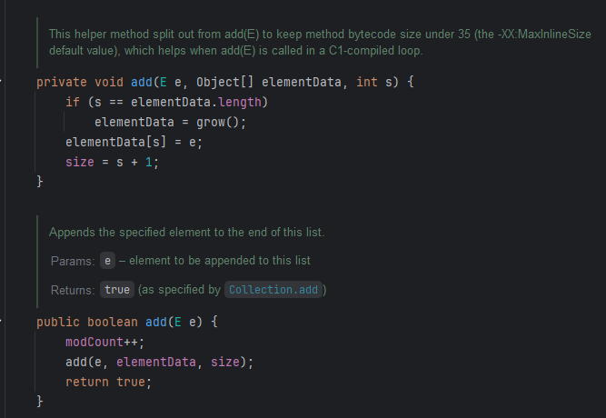
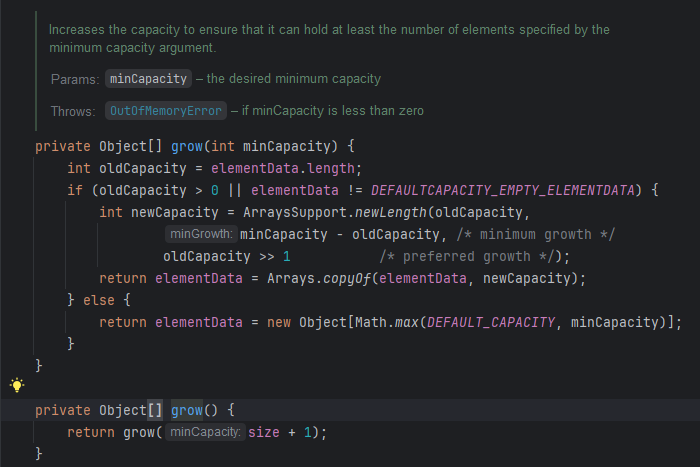
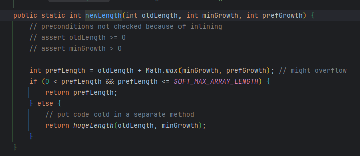
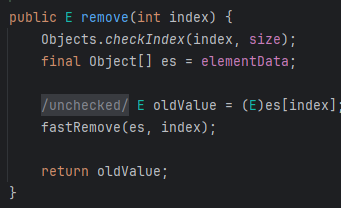
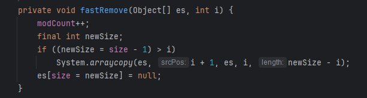
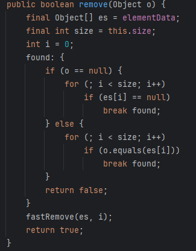

## ArrayList 분석

### 1. 필드 값
- DEFAULT_CAPACITY = 10;
  - 기본 배열의 사이즈를 10으로 지정
- EMPTY_ELEMENTDATA = {};
  - 생성자에 별도로 0을 기입하여 초기화하는 경우 해당 빈 배열을 사용
- DEFAULTCAPACITY_EMPTY_ELEMENTDATA = {};
  - 생성자로 별도의 초기화 값을 지정하지 않고 ArrayList를 생성하는 경우 빈 배열로 사용
- elementData
  - 실제 ArrayList가 가지고 있는 요소 값들
- size
  - 현재 ArrayList의 사이즈를 의미

### 2. 생성자
#### 2.1 초기 값을 지정했을 때
- 초기 값이 0보다 높을 때, elementData에 Object 배열을 해당 초기 값으로 설정하여 생성
- 초기 값이 0일 때 elementData에 EMPTY_ELEMENTDATA를 대입
- 음수와 같은 수가 들어왔을 때 예외 발생

#### 2.2 초기 값을 지정하지 않았을 때
- 기본 값인 DEFAULTCAPACITY_EMPTY_ELEMENTDATA 배열을 대입

### 3. 추가, 삭제 메서드
#### 3.1 add 메서드

- 기본적으로 list에 add할 때는 특정 값만 넣도록 하는데, 아래 메서드의 경우 modCount(구조적으로 수정된 횟수)를 올려주고 실제 List가 가지고 있는 배열과 List가 가지고 있는 배열의 사이즈를 다시 넘겨줌
- 결국 첫번째 메서드로 가게되는데 현재 배열의 크기와 배열에 담긴 요소의 개수가 동일할 경우 grow() 메서드를 통해 늘려줌
- 늘려진 배열에 데이터를 담고 사이즈를 +1 함

- grow 메서드를 보게 되면 현재 배열이 담겨있는 요소의 개수 + 1을 하여 최소 값을 부여해줌
- 만약 기존 배열의 값이 0보다 크거나 기본 배열인 DEFAULTCAPACITY_EMPTY_ELEMENTDATA가 아닌 경우, ArraysSupport 메서드를 통해 새로운 배열의 값을 구한다.
  
  - ArraysSupport의 newLength 메서드를 보면, 예전 값/최소 값/우선 값을 이용하여 새로운 결과 값을 만들어냄
  - 해당 메서드로 넘어오기전에 우선 값으로 oldCapacity >> 1로 되어있는데 만약 이전 값이 10이라면 10의 이진수인 1010 에서 오른쪽으로 시프트연산을 1번하여 0101이 되어 숫자 5가 됨
  - 결국 우선 값은 = 10 + 최대 값(1, 5) 이므로 15가 됨
  - 결국 해당 연산은 기본적으로 1.5배 정도씩 배열이 증가한다고 보면 됨
- 만약 현재 배열의 크기가 0이거나 기본 값일 경우 최소 배열의 값과 기본 배열의 값을 비교하여 높은 것을 채택 함

#### 결론
1. add시 size를 확인함
2. 배열이 꽉 찼을 때 1.5배 정도 씩 늘림
3. 늘려진 배열에 add함 

#### 3.2 remove 메서드
#### 3.2.1 index로 삭제

- 우선 Objects.checkIndex로 현재 배열에서 존재 가능한 index인지 체크함
- 정상적으로 존재하는 index라면 fastRemove를 통해 특정 요소를 삭제

- newSize는 요소를 삭제 한 이후의 List의 사이즈 값을 의미하고, 새로운 List의 현재 사이즈가 index값 보다 크다면 중간에 빈 값을 System.arraycopy로 덮어씌워 복사하고 맨 마지막 값을 null 처리
- System.arraycopy와 Arrays.copyOf의 다른점은 arraycopy는 인자로 들어가는 배열을 그대로 이용해서 사이즈가 변하지 않지만 Arrays.copyOf는 복사해오는 요소만큼만 배열을 만들어서 복사붙여넣기 함
- 또한 arraycopy는 native Method로 되어있어 JNI를 통해 시스템 콜을 이용하여 처리됨
- 마지막에 null 처리를 하게되면 GC가 동작하면서 연결되어있던 배열의 요소를 삭제할 수 있음

#### 3.2.2 값으로 삭제

- null일 때와 null이 아닐 때를 구분하여 동작함
- 여기서 들었던 의문은 실제 List가 사용하고있는 사이즈는 1이지만, 내부 배열의 크기는 5일 때 1빼고는 나머지가 null로 처리되어있을텐데 사용자가 null을 add했을 때 사용자가 넣은 null과 그냥 빈 것을 의미하는 null을 어떻게 구분할 수 있을까?
  - 예를 들어, List [1, null, null, null, null] 일때 null을 add해도 결국 List [1, null, null, null, null]이 되는 것임
  - 하지만 실제로 add시 size가 증가하기 때문에 사이즈가 2면 2까지 오는데 null을 발견한 경우 해당 위치를 찾을 수 있는 것임
- i가 0부터 시작하기 때문에 동일한 값이 여러개 들어있더라도, 가장 먼저 있는 값이 삭제됨
- fastRemove를 통해 위와 동일하게 동작

