## LinkedList 분석
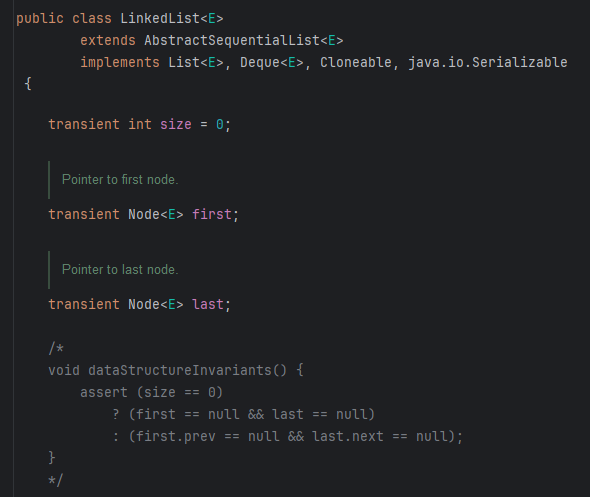

### 1. 필드 값
- first
  - Node중에 가장 첫번째를 가르키고 있는 노드
- last
  - Node중에 가장 마지막을 가르키고 있는 노드

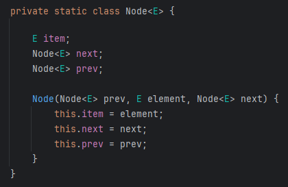
- Node는 내부 static class로 구현되어있으며, item, next, prev를 가짐
- prev는 현재 노드의 이전 node를 의미하고, next는 현재 노드의 다음 노드를 가르 킴
- item은 해당 Node안에 들어간 요소를 의미 함

### 2. 생성자
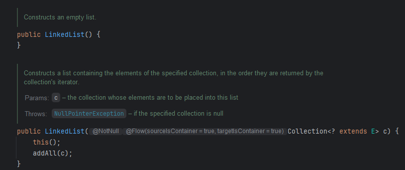
- 빈 생성자로 생성하는 경우 아무것도 없는 빈 LinkedList를 생성
- Collection을 상속받는 다른 컬렉션을 생성자에 매개변수로 받게되면, 해당 컬렉션을 바탕으로 LinkedList로 재구현

### 3. Add 추가 메서드
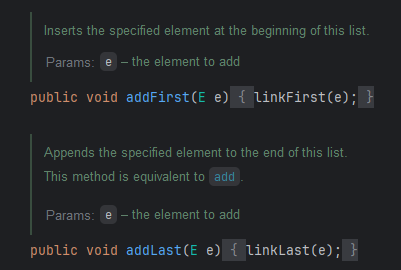

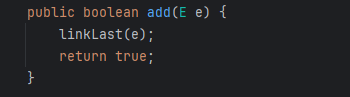
- addFirst는 LinkedList의 가장 앞 단에, addLast는 LinkedList의 가장 뒷 단에 추가
- add는 addLast와 동일하게 동작

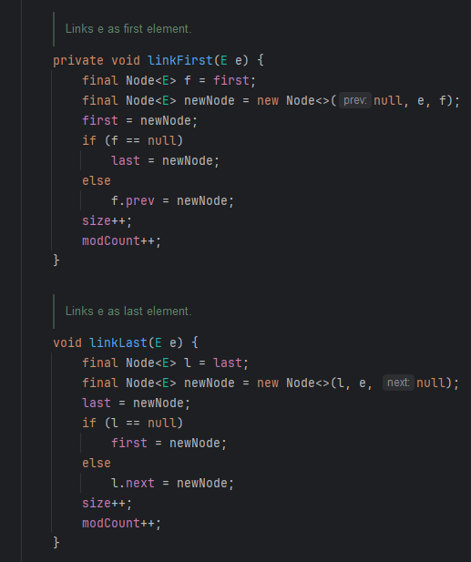
- linkFirst
  1. f에 first를 담아서 temp 용도로 사용
  2. 새로운 Node를 생성하는데 이때 첫번째 노드여서 prev는 없고, 값인 e와 next인 f를 넣음
  3. 그리고 LinkedList의 첫번째 노드를 새로운 노드로 변경
  4. 만약 f가 null 인 경우 처음으로 들어가는 노드이기 때문에 last도 newNode로 설정
  5. 하지만 f가 null이 아닌 경우 다음노드인 f노드의 이전 노드를 newNode로 설정
  6. 사이즈와 수정 횟수 카운트 늘림
- linkLast
  1. l에 last를 담아서 temp 용도로 사용
  2. 새로운 Node를 생성하는데 이때 마지막 노드여서 next는 없고, 값인 e와 prev인 l을 넣음
  3. 마지막 노드에 새로운 노드를 넣음
  4. 만약 last가 없는 경우 처음으로 들어가는 노드이기 때문에 first도 newNode로 설정
  5. 하지만 l이 null이 아닌 경우 마지막의 전 노드인 l의 next로 새로운 노드를 지정
  6. 사이즈와 수정 횟수 카운트 늘림

### 4. remove 삭제 메서드
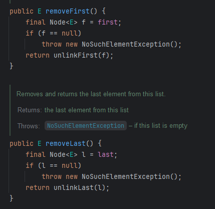
- removeFirst와, removeLast()는 unlinkFirst와 unlinkLast를 이용

- unlinkFirst
  1. 첫번째 노드를 매개변수로 받아 f에 담긴 데이터들을 모두 null 처리하여 GC의 대상이 될 수 있도록 설정
  2. 그리고 LinkedList의 first 변수에 삭제하려는 노드의 next를 담음
  3. 만약 삭제하려는 노드의 next가 null인 경우 첫번째 노드이므로 삭제했을 때 last도 null이 되도록 설정함
  4. 그렇지 않은 경우 next의 이전 노드를 null로 변경
  5. 사이즈와 모드 카운트 횟수를 수정함
- unlinkLast
  1. 마지막 노드를 매개변수로 받아 l에 담긴 데이터들을 모두 null 처리하여 GC의 대상이 될 수 있도록 설정
  2. 그리고 LinkedList의 last 변수에 삭제하려는 노드의 prev를 담음
  3. 만약 last를 가르키고 있는 prev가 null 인 경우 하나만 들어가있는 노드였으므로 first도 null 처리
  4. 그렇지 않은 경우 이전 prev의 next는 null 처리
  5. 사이즈와 모드 카운트 횟수 수정

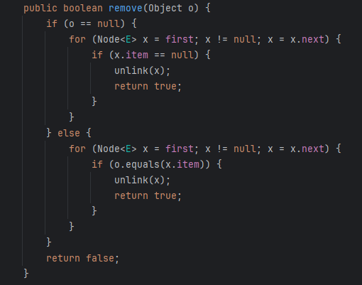

- 일반 remove 메서드는 첫번째 노드부터 next가 null이 나올때까지 돌면서 삭제하려는 노드의 item과 비교하여 맞으면 unlink 메서드를 이용해서 삭제함

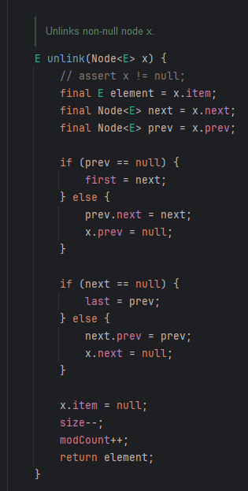
- unlink
  1. 삭제하려는 위치의 Node의 element와 next, prev로 전부 분리
  2. prev가 null 인 경우
    - 맨 앞 노드이므로 first 노드의 next를 first로 지정
  3. null이 아닌 경우
    - 맨 앞 이후의 노드이므로 prev의 next를 next로 변경하고, 삭제하려는 노드의 이전 노드의 값은 null로 변경
  4. next가 null 인 경우[README.md](..%2Farraylist%2FREADME.md)
    - 삭제하려는 노드가 LinkedList의 마지막 노드이므로 next를 prev 노드를 가르키도록 설정
  5. null이 아닌 경우
    - 삭제하려는 노드가 마지막 노드가 아닌 노드이므로, 삭제하려는 노드 x.next는 null이 되고, next의 prev는 prev가 됨
  6. 마지막으로 item을 null 처리하고 사이즈와 모드 카운트 수정

### 5. get 불러오는 메서드
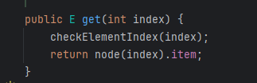

1. 우선 인덱스가 범위 내에 있는 인덱스인지 체크

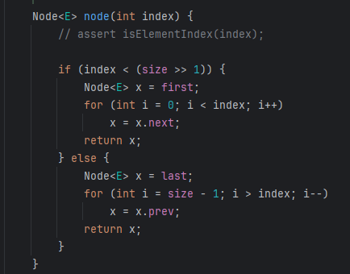

2. 만약 index가 size >> 1 한 것보다 작을 때는 처음부터 탐색
   - size >> 1을 한다는 것은 현재 LinkedList 사이즈의 50퍼센트를 줄인 값 보다 작은 것을 의미 함
   - 예를 들어 size가 10이면 1010 인데 >> 1을 하면 0101이 되어 5가 됨 그럼 index가 5보다 작냐 크냐에 따라 동작
3. 아니라면 last부터 탐색

### 6. ArrayList와 비교해본다면?
- 우선 LinkedList의 경우 add 메서드를 이용하여 특정 위치에 데이터를 추가하려면 해당 index까지 직접 순회해야함. 하지만 삽입 후 ArrayList처럼 배열을 카피하여 옮기거나 하는 작업이 별도로 없기 때문에 삽입에 있어서 더 효과가 좋다고 볼 수 있음
  - 삭제도 동일함
- 하지만 데이터를 찾아오는 것에 있어서 ArrayList의 경우 내부가 배열로 이루어져있어 index 값으로 바로 조회할 수 있는 반면에 LinkedList는 Node의 prev와 next로 이루어져있어 값을 찾으려면 데이터를 전부 다 찾아야하는 불편함이 있음
  - 결국 데이터를 찾을 때는 arrayList는 O(1)이지만 linkedList는 O(N)으로 동작하여 순회에 있어서는 확실히 성능이 좋지 않음
- 삽입 삭제가 많은 곳에서는 LinkedList를 이용하고 조회가 많은 경우 ArrayList를 사용하면 좋을 것 같음
  - 예를 들어, Queue를 이용할 때도 ArrayList를 이용하게되면 데이터를 앞쪽에 삽입할 때 데이터를 계속 뒤로 밀어줘야하는 문제가 있지만 LinkedList의 경우 그냥 이어붙여주면 됨