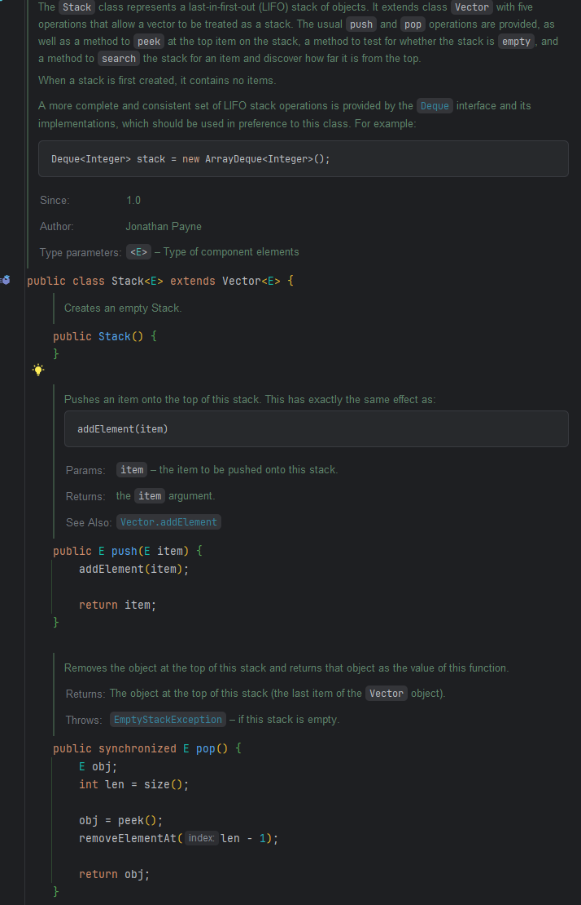
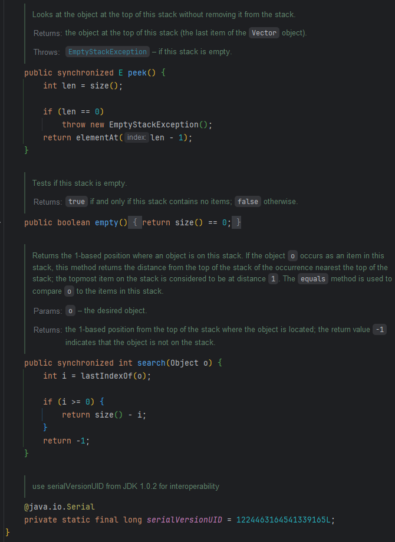
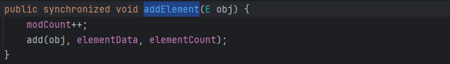
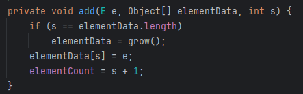
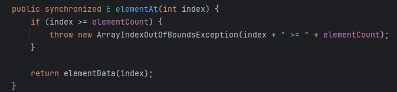
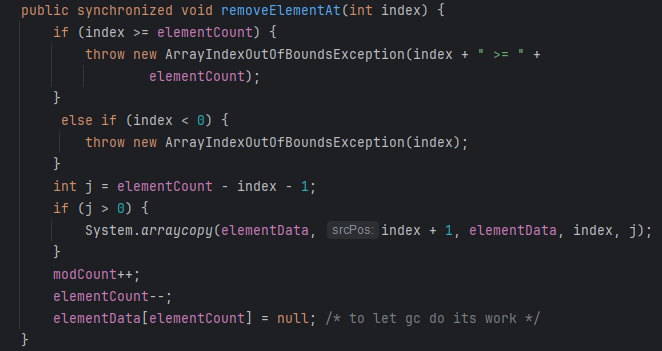

## Stack 및 Vector 분석

- Stack은 선입 선출 구조를 띔
- Stack은 다른 자료구조와 다르게 위에 나와있는 코드가 전부임
- 특징을 보면 Synchronized로 동기화를 진행하고 있으며 -> 이것 때매 성능상 저하가 있을 것 같음, Vector를 상속받고 있음
- docs를 보아도 Stack을 사용하기보다 Deque를 이용할 것을 권장하고 있음
- 코드를 보면 결국 Vector의 메서드를 활용해서 구현되어있음

### push 삽입
- addElement(item)을 이용하여 데이터를 삽입

#### Vector addElement 메서드

- modCount(수정횟수)를 올려주고 add 메서드로 진입

#### Vector add 메서드

- 결국 Vector의 add 메서드도 List의 add와 비슷함
- Vector도 내부적으로 배열로 이루어져있는데 해당 배열에 데이터를 추가하는 방식이고, 이 메서드는 특정 인덱스에 추가하는 것이 아닌 맨 마지막에 추가함
  - 또한 사이즈가 부족할 때 grow 메서드로 배열의 크기를 늘리는 것도 비슷함
  - 다른점은 List는 기존 배열의 크기에서 >> 1 을 이용하여 약 1.5배를 늘리는 반면에, Vector는 별도의 지정을 하지 않으면 이전 oldCapacity를 따름

### pop 추출
- Vector의 size 메서드를 이용하여 현재 Vector가 가지고 있는 사이즈에 - 1한(마지막 데이터) 값을 삭제하고, 삭제하기전 peek()으로 마지막 데이터를 불러옴

#### Vector의 elementAt

- 해당 메서드는 Stack에서 peek 메서드가 동작했을 때 실행되는 메서드로 index가 범위 내의 인덱스인지 체크한 이후에 인덱스에 해당하는 데이터를 반환하는 메서드임

#### Vector의 removeElementAt

- 해당 메서드는 Stack에서 실제로 pop 했을 때 Vector로 이루어진 Stack안의 데이터를 삭제하기 위한 메서드임
- 우선 index가 정상 범위 내인지 체크하고, 기존 Array에 인덱스가 중간에 있어서 중간을 삭제했을 경우 그만큼 뒤의 데이터를 땡겨오는 복사를 실행
- 마지막으로 데이터를 nul 처리하여 GC되도록 처리

### 나의 생각
평소에 Stack보다 Deque를 많이 사용하라고 말만 들었지 왜 사용하면 안되는지에 대해 잘 몰랐었다. 확실히 코드를 까보니까 Synchronized로 인해 Thread-safe를 보장하기 위한 성능저하가 어느정도 있고 Vector를 이용하는데 이 Vector안의 grow 코드도 List보다 효율적인 것 같지는 않았다. Thread-safe를 보장하고 싶은데 성능이 중요하지 않다면 Stack을 이용해볼 것 같고 그렇지 않으면 평소에는 Deque를 사용할 것 같다.